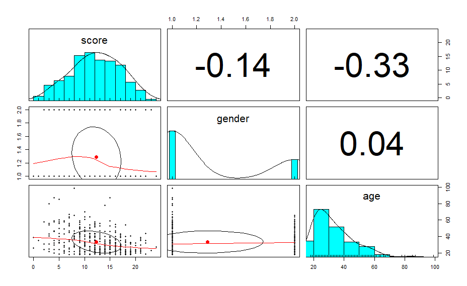
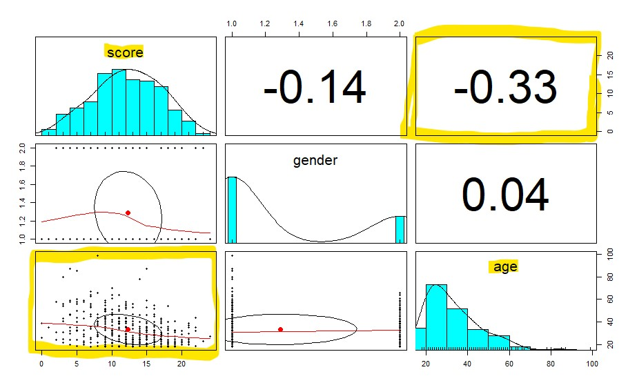
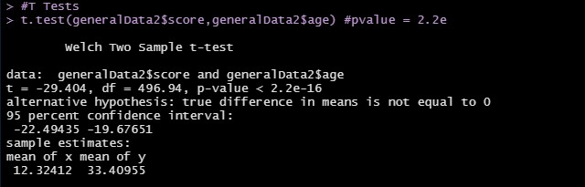
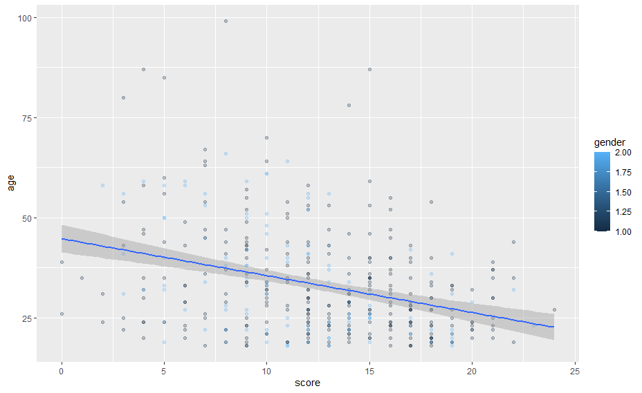

## Data
 1. Citation or title of data set
    IQ1

 2. Weblink to data set
    https://openpsychometrics.org/_rawdata/
      "5/25/2012	| Answers to an experimental IQ Test previously offered on this website.
        | 25 questions/answers, age, gender. | 400 | IQ1

 3. What are the variables which are relevant to your study?
    Score, Age, Gender

### Correlations, Plots and Screenshots:

 _1. What is the relationship for which you are forming an argument?_
    There seems like no strong correlations in this group just looking at the numbers. The relationship between scores and ages might have something in comparison to the other relationships in the data.

 _2. What reasons do you have to believe that the relationship exists? Show and discuss plots, correlation results and related evidence._
 
    For score and age, their is -0.33, which is not high enough to be considered a strong correlation. This is the highest value though on the pairs panel made with the data.

### T-tests

_Describe your t-tests, their variables and anything about them to help support your argument. Please justify each of your t-tests._
    I tested all of the relationships that I filtered out. So I did all the relationships possible between score, age, and gender. When running them, the only one with a significant p-value was between score and age. The p-value is less than 2.2e-16 which is much less than zero. This means to reject the null hypothesis and look at the alternative that there is a correlation. This fits along with my observations from the pairs panel.

### Linear Models

_Describe your Linear models, their variables and anything about them to help support your argument. Please justify each of your linear models._
    The linear model is `y = 16.2565 + -0.1177x` which shows the relationship shows small change but from our other tests we know this correlation is present and reasonable to look at. For every year increased in age, the score of the person drops by 0.1177 points. With the ages only collected older than 18, it suggests the people are 20 tend to have higher IQs. 

